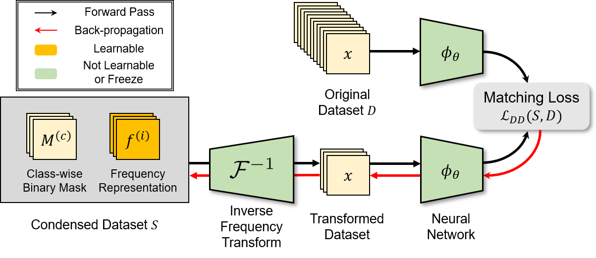

# Frequency Domain-based Dataset Distillation (FreD) [NeurIPS 2023] 

This repository contains an official PyTorch implementation for the paper "Frequency Domain-based Dataset Distillation" in NeurIPS 2023.

**[Donghyeok Shin](http://kaal.dsso.kr/bbs/board.php?bo_table=sub2_1&wr_id=8) \*, [Seungjae Shin](https://sites.google.com/view/seungjae-shin) \*, and Il-Chul Moon**   
<sup> * Equal contribution </sup> <br>

| [paper](https://arxiv.org/abs/2311.08819) | [slides](https://neurips.cc/media/neurips-2023/Slides/71874.pdf) | [pretrained](https://drive.google.com/drive/folders/1r1OMVv9llejGmpHfK5DpW4m57Dz_SZ2n?usp=sharing) |

## Updates
- (2024.05.07) We uploaded the distilled synthetic dataset except in a few cases. Please refer to [pretrained](https://drive.google.com/drive/folders/1r1OMVv9llejGmpHfK5DpW4m57Dz_SZ2n?usp=sharing). The rest of the cases will be uploaded as soon as possible. 

## Overview

> **Abstract** *This paper presents FreD, a novel parameterization method for dataset distillation, which utilizes the frequency domain to distill a small-sized synthetic dataset from a large-sized original dataset. Unlike conventional approaches that focus on the spatial domain, FreD employs frequency-based transforms to optimize the frequency representations of each data instance. By leveraging the concentration of spatial domain information on specific frequency components, FreD intelligently selects a subset of frequency dimensions for optimization, leading to a significant reduction in the required budget for synthesizing an instance. Through the selection of frequency dimensions based on the explained variance, FreD demonstrates both theoretical and empirical evidence of its ability to operate efficiently within a limited budget, while better preserving the information of the original dataset compared to conventional parameterization methods. Furthermore, based on the orthogonal compatibility of FreD with existing methods, we confirm that FreD consistently improves the performances of existing distillation methods over the evaluation scenarios with different benchmark datasets.*

## Requirements
This code was tested with CUDA 11.4 and Python 3.8.
```
pip install -r requirements.txt
```

## Usage
The main hyper-parameters of FreD are as follows: 
- `msz_per_channel` : Memory size per each channel
- `lr_freq` : Learning rate for synthetic frequency representation
- `mom_freq` : Momentum for synthetic frequency representation

The detailed values of these hyper-parameters can be found in our paper. 
For other hyper-parameters, we follow the default setting of each dataset distillation objectives.
Please refer to the bash file for detailed arguments to run the experiment.

Below are some example commands to run FreD with each dataset distillation objective. 
### FreD with Gradient Matching (DC)
- Run the following command: 
```
cd DC/scripts
sh run_DC_FreD.sh
```

### FreD with Distribution Matching (DM)
- Run the following command:
```
cd DM/scripts
sh run_DM_FreD.sh
```

### FreD with Trajectory Matching (TM)
- Since TM need expert trajectories, run `run_buffer.sh` to generate expert trajectories before distillation:
```
cd TM/scripts
sh run_buffer.sh
sh run_TM_FreD.sh
```

### FreD with Other Dataset Distillation Objective
FreD is a highly compatible parameterization method regardless of the dataset distillation objective. 
Herein, we provide simple guidelines for how to use FreD with different dataset distillation objectives.
```
# Define the frequency domain-based parameterization 
synset = SynSet(args)

# Initialization
synset.init(images_all, labels_all, indices_class)

# Get partial synthetic dataset
images_syn, labels_syn = synset.get(indices=indices)

# Get entire dataset (need_copy is optional)
images_syn, labels_syn = synset.get(need_copy=True)
```
### ImageNet-[A,B,C,D,E]
- For ImageNet-[A,B,C,D,E] experiments, we built upon the GLaD's official code.
- Run the following command with appropriate objective in `XXX`:
- If you want to run FreD with TM, run `run_buffer.sh` before just like above.
```
cd ImageNet-abcde/scripts
sh run_XXX_FreD.sh
```

### 3D-MNIST
- Download [3D-MNIST](https://www.kaggle.com/datasets/daavoo/3d-mnist) dataset.
- Run the following command:
```
cd 3D-MNIST/scripts
sh run_DM_FreD.sh
```

### Robustness of Corruption
- Download the corrupted dataset: [CIFAR-10.1](https://github.com/modestyachts/CIFAR-10.1), [CIFAR-10-C](https://zenodo.org/records/2535967), and [ImageNet-C](https://zenodo.org/records/2235448#.YpCSLxNBxAc).
- Place the trained synthetic dataset at `corruption-exp/trained_synset/FreD/{dataset_name}`. 
- Run the following command:
```
cd corruption-exp/scripts
sh run.sh
```
 
## Experiment Results 
- Test accuracies (%) on low-dimensional datasets (≤ 64×64 resolution) with TM.

| | MNIST | FashionMNIST | SVHN | CIFAR-10 | CIFAR-100 | Tiny-ImageNet |
| :------: | :-----:  | :----: | :-----: | :----: | :----: | :----: |
| 1 img/cls |  95.8 | 84.6 | 82.2 | 60.6 | 34.6 | 19.2 |
| 10 img/cls | 97.6 | 89.1 | 89.5 | 70.3 | 42.7 | 24.2 |
| 50 img/cls |  -   |  -   | 90.3 | 75.8 | 47.8 | 26.4 |

- Test accuracies (%) on Image-[Nette, Woof, Fruit, Yellow, Meow, Squawk] (128 × 128 resolution) with TM.

| | ImageNette | ImageWoof | ImageFruit | ImageYellow | ImageMeow | ImageSquawk | 
| :------: | :-----:  | :----: | :-----: | :----: | :----: | :----: |
| 1 img/cls |  66.8 | 38.3 | 43.7 | 63.2 | 43.2 | 57.0 |
| 10 img/cls | 72.0 | 41.3 | 47.0 | 69.2 | 48.6 | 67.3 |

- Test accuracies (%) on ImageNet-[A, B, C, D, E] (128 × 128 resolution) with TM under 1 img/cls.

| | ImageNet-A | ImageNet-B | ImageNet-C | ImageNet-D | ImageNet-E | 
| :------: | :-----:  | :----: | :-----: | :----: | :----: |
| DC w/ FreD | 53.1 | 54.8 | 54.2 | 42.8 | 41.0 |
| DM w/ FreD | 58.0 | 58.6 | 55.6 | 46.3 | 45.0 |
| TM w/ FreD | 67.7 | 69.3 | 63.6 | 54.4 | 55.4 |

More results can be found in our paper.

## Citation
If you find the code useful for your research, please consider citing our paper.
```bib
@inproceedings{shin2023frequency,
  title={Frequency Domain-Based Dataset Distillation},
  author={Shin, DongHyeok and Shin, Seungjae and Moon, Il-chul},
  booktitle={Thirty-seventh Conference on Neural Information Processing Systems},
  year={2023}
}
```
This work is heavily built upon the code from
 - *Bo Zhao, Konda Reddy Mopuri, and Hakan Bilen. Dataset condensation with gradient matching. arXiv preprint arXiv:2006.05929, 2020.* [Code Link](https://github.com/VICO-UoE/DatasetCondensation)
 - *Bo Zhao and Hakan Bilen. Dataset condensation with distribution matching. In Proceedings of the IEEE/CVF Winter Conference on Applications of Computer Vision, pages 6514–6523, 2023.* [Code Link](https://github.com/VICO-UoE/DatasetCondensation)
 - *George Cazenavette, Tongzhou Wang, Antonio Torralba, Alexei A Efros, and Jun-Yan Zhu. Dataset distillation by matching training trajectories. In Proceedings of the IEEE/CVF Conference on Computer Vision and Pattern Recognition, pages 4750–4759, 2022.* [Code Link](https://github.com/georgecazenavette/mtt-distillation)
 - *George Cazenavette, Tongzhou Wang, Antonio Torralba, Alexei A Efros, and Jun-Yan Zhu. Generalizing dataset distillation via deep generative prior. In Proceedings of the IEEE/CVF Conference on Computer Vision and Pattern Recognition, pages 3739–3748, 2023.* [Code Link](https://github.com/GeorgeCazenavette/glad/tree/main)
